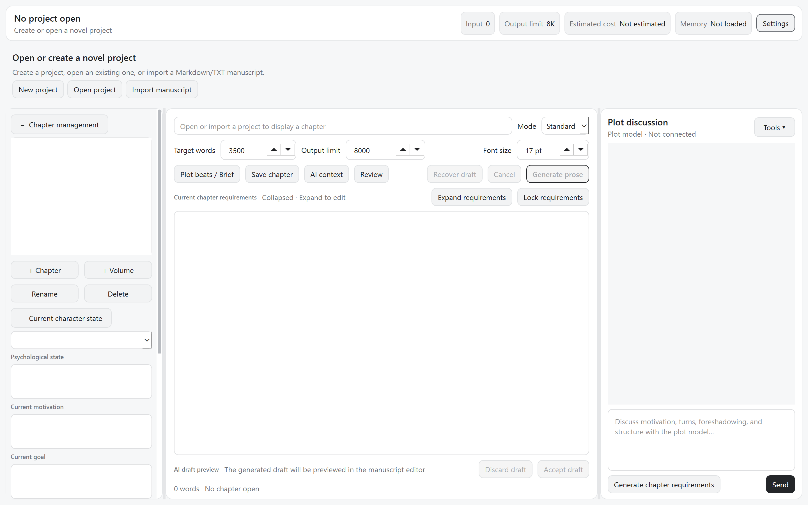
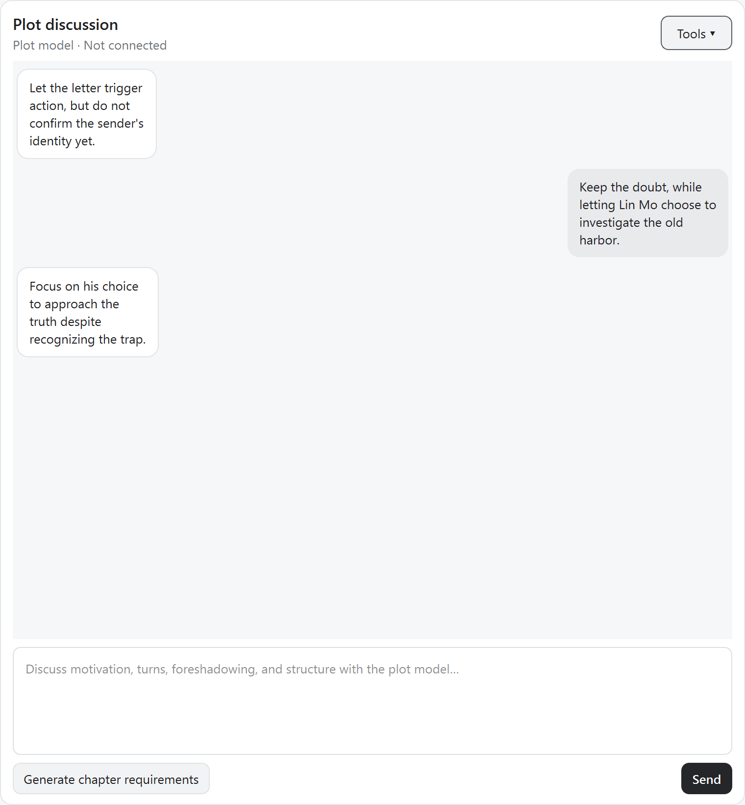
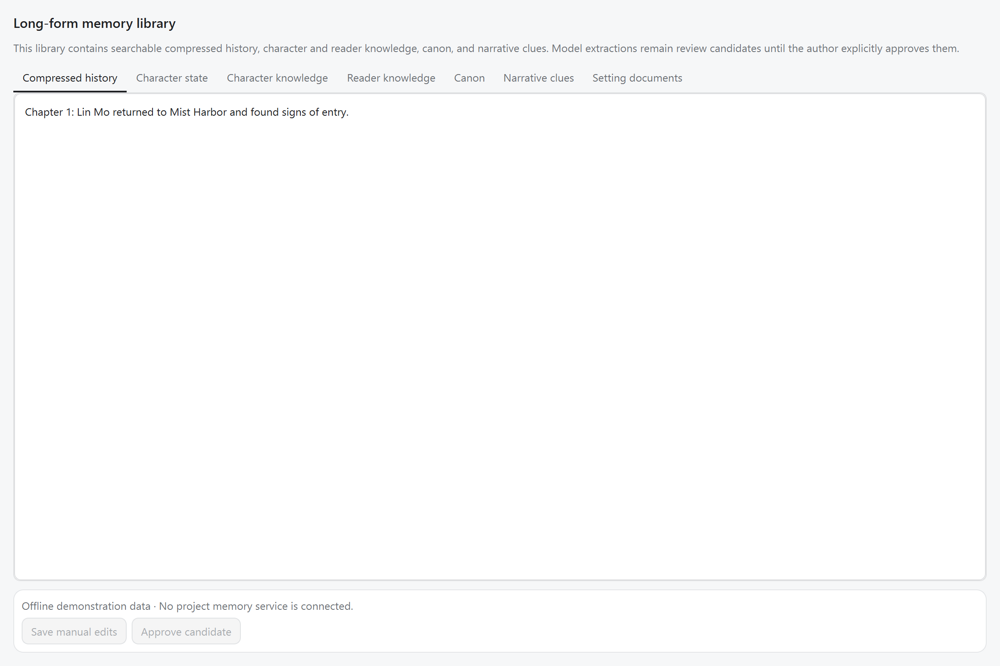
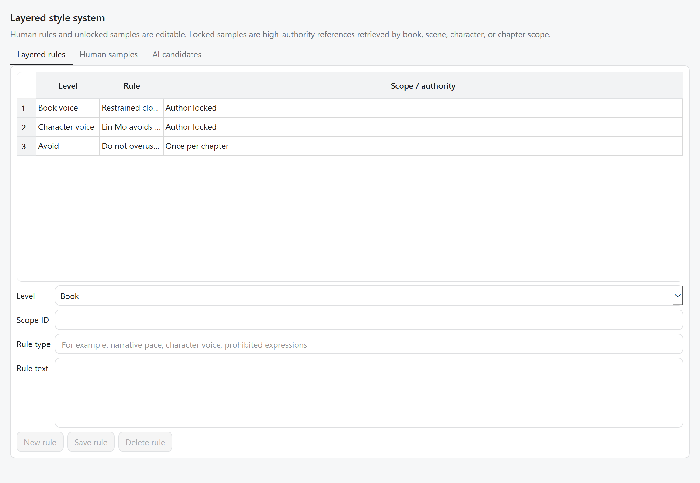
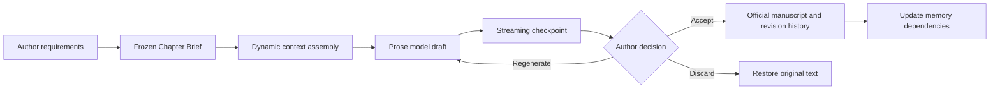
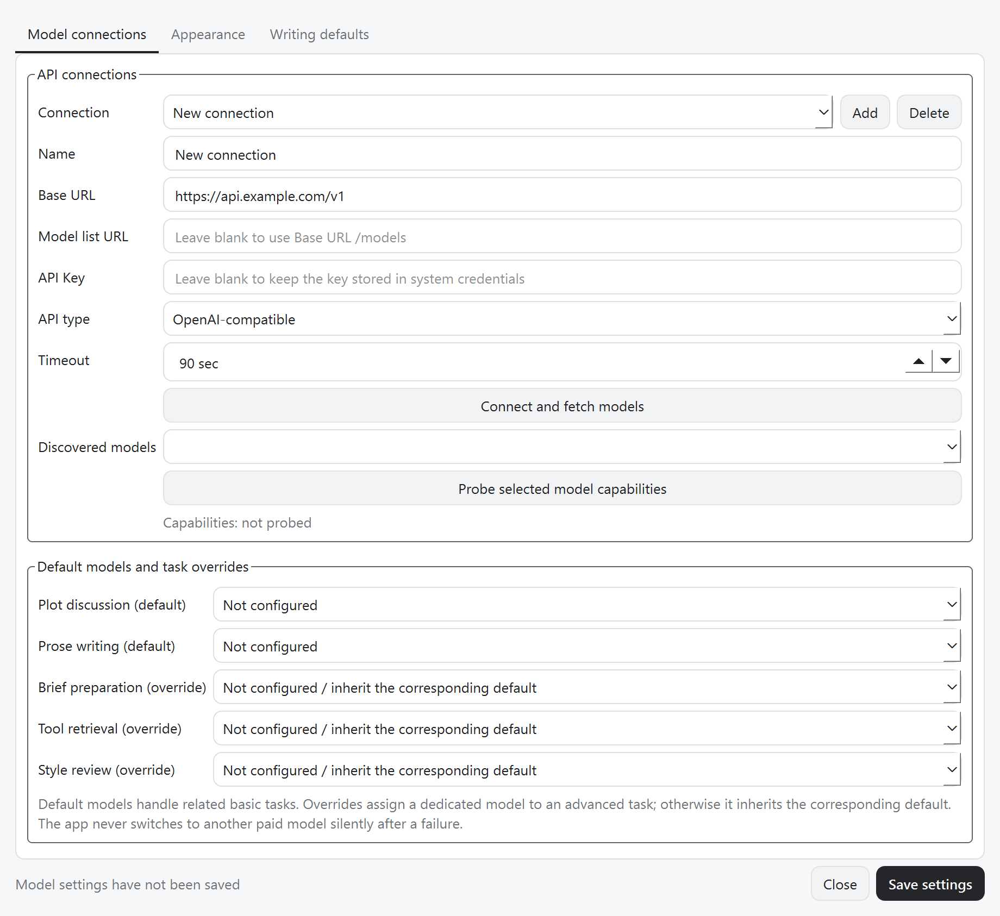

# AI Novel Studio

[简体中文](README.md) · **English**

A local-first AI writing workspace for long-form and ultra-long-form fiction.

> Current release: V3 development preview. Feedback, bug reports, and contributions are welcome.

## Overview

AI Novel Studio is a desktop application designed for human-led, AI-assisted novel writing.
It combines plot discussion, prose generation, structured long-term memory, character state,
style guidance, and revision review in one inspectable and recoverable workflow.

The project is designed for novels that may grow to millions of words. Instead of repeatedly
sending the entire manuscript to a model, it keeps recent chapters at high fidelity and turns
older material into layered summaries, character development, canon facts, narrative clues,
and knowledge boundaries. Context is assembled dynamically for each task.

### Design principles

- The author always has final control.
- Model output never silently overwrites the official manuscript.
- Manuscript text, summaries, character state, clues, and canon are stored separately.
- Model-extracted memory enters review before it becomes trusted context.
- Plot discussion and prose writing can use different models.
- The interface can switch between Simplified Chinese and English and remembers the selection.
- Important operations retain provenance, history, and recovery boundaries.

## Installation

### Requirements

- Windows 10 or Windows 11;
- Python 3.11 or newer;
- Network access to your selected model API.

The `.venv` directory is intentionally excluded from GitHub because it contains machine-specific
Python paths and binary packages. Each user should create a local virtual environment.

### One-click Windows setup (recommended)

1. Select `Code → Download ZIP` on GitHub and extract the archive, or clone the repository.
2. Double-click `setup.bat` in the project root.
3. When installation finishes, double-click `launch.bat`.
4. Add your model connection and API key in Settings after the first launch.

### Manual PowerShell setup

```powershell
git clone https://github.com/13422100338/AI-Novel-Studio.git
cd AI-Novel-Studio
py -3 -m venv .venv
.\.venv\Scripts\python.exe -m pip install --upgrade pip
.\.venv\Scripts\python.exe -m pip install -e .
```

Launch with `launch.bat`, or run:

```powershell
.\.venv\Scripts\ai-novel-studio.exe
```

For development tools:

```powershell
.\.venv\Scripts\python.exe -m pip install -e ".[dev]"
.\.venv\Scripts\python.exe -m pytest
.\.venv\Scripts\python.exe -m ruff check src tests
.\.venv\Scripts\python.exe -m mypy src\ai_novel_studio
```

## Main workspace



The main window uses a three-column layout.

### Chapter and character panel

- Volume and chapter tree management;
- Create, rename, and safely delete volumes and chapters;
- Move chapters instead of deleting them when a volume is removed;
- View and edit current character motivation, psychology, goals, relationships, and activity;
- Open memory, style, and review workspaces;
- Collapsible sections and a scrollable sidebar.

### Manuscript editor

- Editable chapter title and official manuscript text;
- Adjustable font size, target word count, and output token limit;
- Editable and lockable current-chapter requirements;
- Reviewable Chapter Brief;
- Generate, cancel, recover, accept, or discard drafts;
- Revision history and guarded saves.

Generated prose remains a draft until the author explicitly accepts it.

### Plot discussion

- Separate plot model with chat-style messages;
- Project-level conversation history;
- Dynamic compression of older discussion while retaining recent turns;
- Access to the current chapter and earlier plot summaries;
- Generate a formal current-chapter requirement from discussion;
- Synchronized embedded and detached chat windows;
- Optional read-only tool retrieval and evidence tracing.

## Detached plot chat



The detached window shares the same project conversation as the embedded panel. In normal mode,
the plot model receives stable system guidance, earlier novel summaries, compressed older chat,
recent messages, the current chapter, and the latest user request.

When tool retrieval is enabled, the model may request read-only access to:

- Chapter excerpts;
- Compressed history;
- Character state and knowledge;
- Canon facts;
- Active clues;
- Style rules;
- Review evidence.

Tools cannot directly modify manuscript text, memory, settings, or exports. Evidence traces show
which tool was requested, its parameters, returned sources, and any truncation.

## Long-form memory



The memory library is not a single shortened version of the manuscript. It maintains multiple
types of context with separate authority and review states:

- Layered chapter, arc, volume, and book summaries;
- Character motivation, psychology, goals, relationships, and recent activity;
- Canon facts and world rules;
- Foreshadowing, open questions, promises, and clue events;
- Character knowledge and reader knowledge;
- Style rules and model-extracted style candidates;
- Searchable source documents and setting material.

Memory states include:

- `REVIEW`: model candidate awaiting author review;
- `APPROVED`: reviewed and available as trusted context;
- `LOCKED`: author-protected and not replaceable by a model;
- `STALE`: a source changed and the dependent memory may need rebuilding.

Setting documents can be pasted directly into the memory workspace. The original material is
preserved, while extracted characters, world rules, plot plans, and style guidance enter review
instead of silently becoming canon.

## Style system



Style guidance can be scoped to the whole book, a genre or scene, a character, or a chapter.
The system supports editable rules, prohibited expressions, frequency limits, and human-written
reference samples. Locked samples remain high-authority references.

## Chapter requirements and Briefs

Current-chapter requirements hold the author's highest-priority instructions, such as required
events, point of view, emotional tone, forbidden revelations, and ending hooks. Plot discussion
may propose a draft requirement but cannot overwrite a locked author requirement.

A Chapter Brief turns those requirements into a structured handoff containing dramatic purpose,
hard events, soft goals, protected facts, creative freedom, and relevant memory sources. Standard
and strict generation modes use a frozen Brief to prevent context from changing mid-generation.

## Prose generation pipeline



Context may include the current requirement, frozen Brief, recent full chapters, older summaries,
volume and book context, relevant character state, active clues, canon, knowledge boundaries,
style rules, samples, and retrieved evidence. A Context Manifest records what was selected or
omitted and why.

Streaming checkpoints allow interrupted drafts to be inspected and recovered without silently
starting another paid model request. Acceptance checks the chapter revision and draft hash before
writing official text.

## Review and bounded repair

Deterministic checks cover conditions the program can verify directly, while semantic review can
identify motivation drift, knowledge violations, canon conflicts, forgotten clues, timeline
problems, weak causality, and style drift.

Review creates findings and bounded repair proposals. A model cannot directly replace official
text; the author decides whether to apply a repair.

## Model connections and routing



AI Novel Studio supports OpenAI-compatible APIs and compatible third-party gateways. Plot
discussion, prose generation, Brief preparation, retrieval, memory extraction, and style review
can inherit default routes or use task-specific overrides.

Connection settings include Base URL, model-list endpoint, API key, timeout, model discovery, and
capability probing. API keys use the operating system's secure credential storage and should not
be committed to the repository.

The application probes streaming, structured JSON, tool calling, and reasoning capabilities
because third-party gateways may expose different features under the same model name.

## Token and cost control

Authors can choose target length, output-token limits, task models, and whether tool retrieval is
enabled. The application manages older-chat compression, history budget, recent-versus-distant
context balance, extraction limits, tool budgets, and context manifests.

The top bar displays estimated input, output allowance, cost, and memory status when the provider
returns sufficient usage and pricing information.

## Import and project data

The current importer supports TXT and Markdown, chapter-title detection, and optional volume
detection. DOCX import is planned; convert DOCX files to TXT or Markdown for the current release.
Official manuscript files are stored as Markdown, while structured metadata is stored in SQLite
using stable UUID relationships.

```text
project/
├─ project.json
├─ project.sqlite3
├─ manuscript/
│  └─ volume_<UUID>/
│     └─ chapter_<UUID>.md
├─ checkpoints/
├─ backups/
└─ exports/
```

## Privacy and safety

- Official text and generated drafts are separated;
- Models cannot overwrite author-locked memory;
- Revision history and checkpoints support recovery;
- API keys are excluded from public configuration;
- User manuscripts, project databases, backups, and exports must not be committed;
- Release checks should scan for names, local paths, credentials, and private content.

## Current status

V3 is a development preview with the primary architecture and writing workflow in place. Real
projects may still expose provider compatibility issues, long-project performance limits, and UI
edge cases. Model output remains untrusted and should be reviewed before it becomes authoritative.

## Roadmap

Near-term priorities:

1. Improve one-click installation, Windows packaging, and upgrade workflows;
2. Strengthen end-to-end testing for import, memory, generation, review, and acceptance;
3. Add cancellable, resumable, and retryable background jobs;
4. Improve memory conflict handling, provenance, and version comparison;
5. Expand context inspection and long-project diagnostics.

Longer-term directions include stable chapter-to-arc-to-volume-to-book summarization, clue and
knowledge visualizations, native function calling, user-approved multi-agent workflows, a plugin
system, cross-platform UI exploration, and optional local-first synchronization.

## Contributing

Bug reports and focused pull requests are welcome. Please avoid including manuscripts, databases,
API keys, personal paths, or generated project data in issues and commits. For development, install
the `dev` dependency group and run the test, Ruff, and mypy commands shown above.

## License

This repository is released under the [MIT License](LICENSE). See
[THIRD_PARTY_NOTICES.md](THIRD_PARTY_NOTICES.md) for third-party notices.
