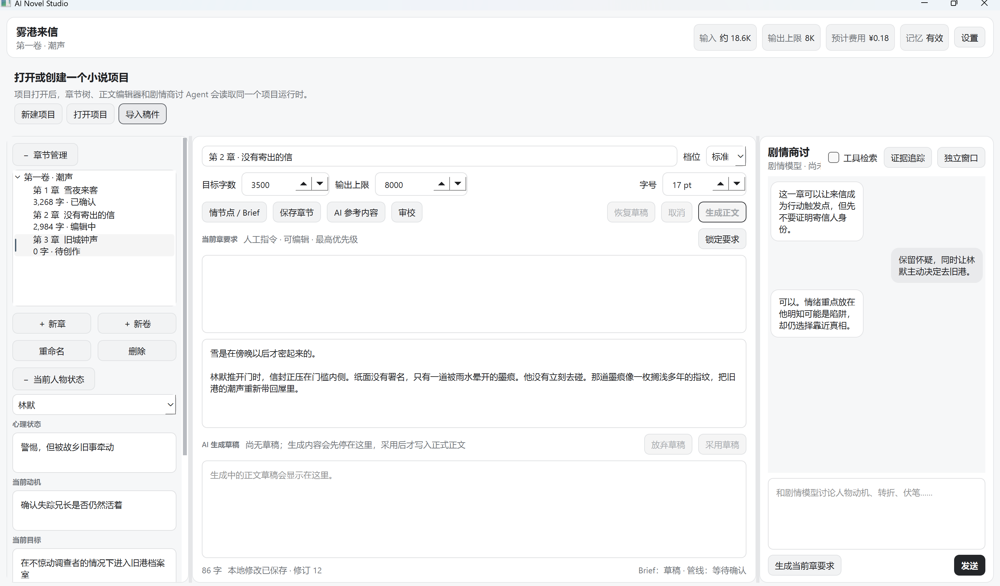
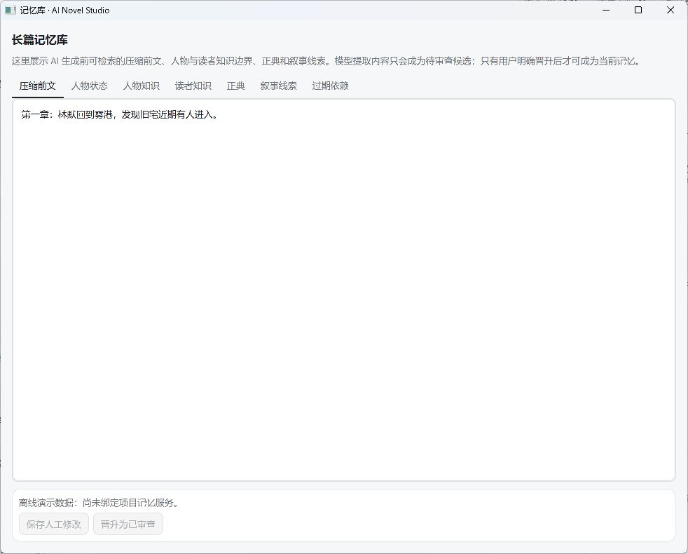
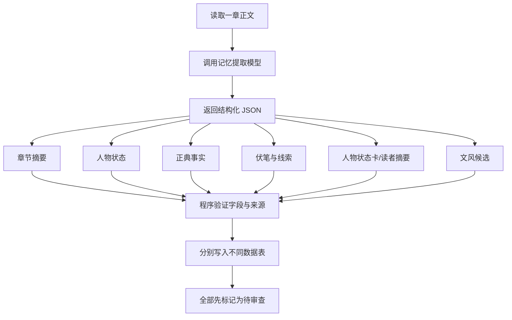
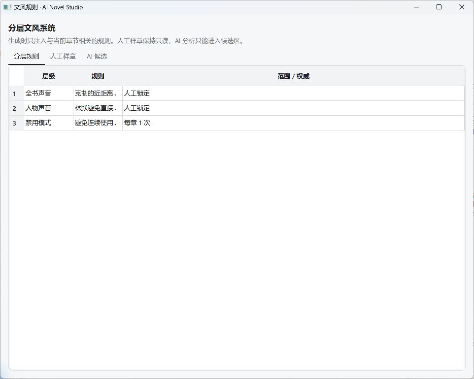
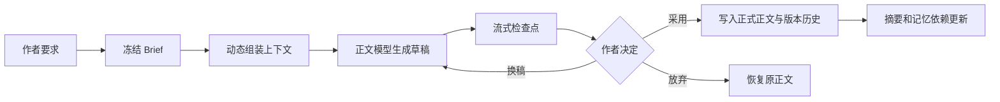
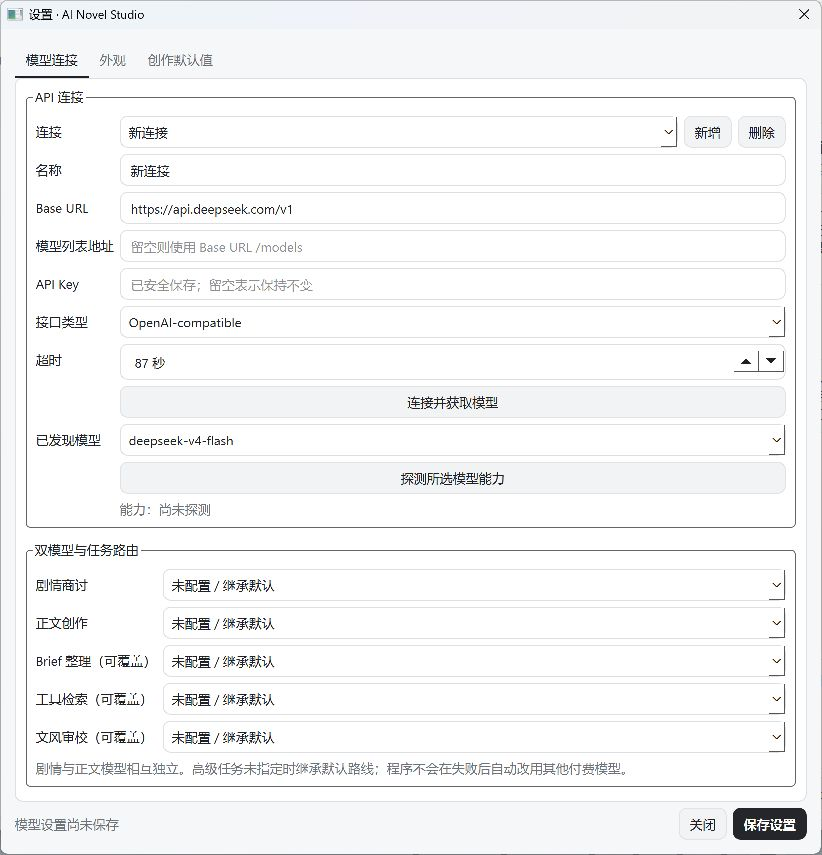
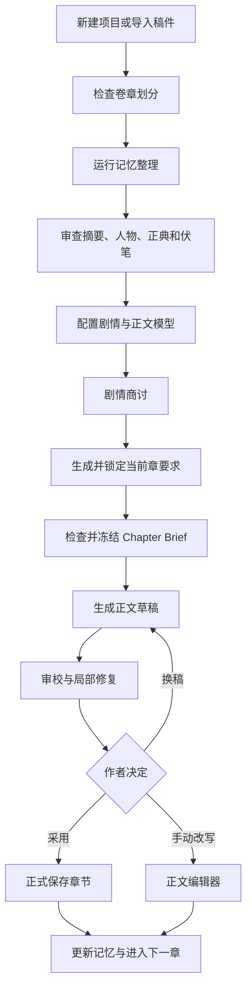

# AI Novel Studio 产品介绍与发展说明

> 文档性质：内部审阅稿  
> 适用版本：V3 当前开发分支  
> 更新日期：2026-07-12

## 1. 产品简介

AI Novel Studio 是一款本地优先、面向长篇和超长篇小说的 AI 辅助创作桌面程序。

它不是“一键让模型写完整本书”的自动生成器，而是把作者、剧情模型、正文模型、长篇记忆、人物状态、文风规则和审校系统组织成一条可检查、可修改、可恢复的创作流水线。

产品的长期目标是支持百万字规模的小说项目，同时避免把全部原稿反复塞入模型上下文。程序会保留最近章节的高保真内容，把较远历史整理成摘要、人物成长、正典、伏笔和知识边界，再根据当前任务动态选择需要发送给模型的材料。

### 核心理念

- 作者拥有最终决定权，模型不能静默覆盖正式正文。
- 正文、摘要、人物状态、伏笔和正典分别保存，避免互相污染。
- 模型提取结果默认先进入待审查区，经用户确认后才成为高权威记忆。
- 不同任务可以使用不同模型，降低成本并发挥模型各自优势。
- 长篇一致性依靠结构化记忆和动态检索，而不是无限扩大提示词。
- 所有关键生成、采用、审校和修复操作都应具备来源记录与恢复边界。

## 2. 当前开发状态说明

本文使用以下标记描述功能成熟度：

| 标记 | 含义 |
|---|---|
| ✅ 已接入 | 已有代码、持久化和自动化测试，基本形成闭环 |
| 🟡 待验证 | 核心代码已存在，但仍需要更多真实项目操作和 UI 验证 |
| 🧪 实验性 | 可以使用，但模型兼容性、交互或异常处理仍可能有问题 |
| 🗺️ 规划中 | 设计方向明确，尚未完整实现 |

当前版本已经拥有完整的软件骨架和大部分核心服务，但仍属于开发版本。尤其需要继续关注启动入口同步、第三方 API 兼容、超长项目压力、部分窗口交互和真实写作流程回归。

## 3. 主工作区



主界面采用三栏布局。

### 3.1 左栏：章节与项目状态

左栏承担项目导航和当前创作节点的信息管理。

重要功能：

- ✅ 卷、章树形管理。
- ✅ 新建卷和章节。
- ✅ 重命名卷和章节。
- ✅ 删除卷时迁移其中章节，避免章节随卷消失。
- ✅ 当前人物状态查看和修改。
- ✅ 人物新增、选择、编辑和删除入口。
- ✅ 项目工作台入口：记忆库、整理记忆、文风规则、审校工作台。
- ✅ 左栏滚动和区块折叠。

人物状态包含：

- 当前动机；
- 心理状态；
- 当前目标；
- 人物关系；
- 最近活动；
- 对应章节位置。

### 3.2 中栏：正文创作

中栏是正式章节正文的主要编辑区域。

重要功能：

- ✅ 章节标题和正文编辑。
- ✅ 正文字体大小调整。
- ✅ 目标字数设置。
- ✅ 用户自定义模型输出 Token 上限。
- ✅ 当前章要求编辑、折叠与锁定。
- ✅ Chapter Brief 查看和冻结。
- ✅ AI 参考内容查看。
- ✅ 生成、取消、恢复、采用和放弃草稿。
- ✅ 正文修订记录和安全保存。
- 🟡 草稿改为在正文框中预览的新版交互已写入源码，需要继续核对所有启动入口是否加载同一份源码。

AI 生成内容不会自动成为正式正文。生成完成后，用户可以选择：

- 采用草稿；
- 放弃并恢复原正文；
- 换一个草稿；
- 进入审校流程；
- 采用后继续手动修改。

### 3.3 右栏：剧情商讨

右栏使用独立剧情模型与作者讨论剧情走向，不直接承担正式正文输出。

重要功能：

- ✅ 气泡式用户/模型对话。
- ✅ 项目级聊天历史保存。
- ✅ 较早聊天动态压缩，保留最近对话。
- ✅ 自动读取当前章节完整正文。
- ✅ 自动读取当前章之前的压缩剧情记忆。
- ✅ 已审查摘要优先；待审查摘要以低权威候选形式提供。
- ✅ 一键将商讨内容整理为正式“当前章要求”。
- ✅ 内嵌窗口和独立窗口对话同步。
- ✅ 可选只读工具检索。
- ✅ 最近一次 Agent 运行的证据追踪。
- 🟡 工具区折叠新版已写入源码，需要继续核对发布启动入口。

## 4. 独立剧情商讨窗口


独立窗口适合在单独屏幕上集中讨论剧情。内嵌窗口和独立窗口共享同一项目聊天记录。

### 普通商讨模式

普通模式主要接收：

1. 剧情导演系统规则；
2. 当前章之前的小说摘要；
3. 较早聊天摘要；
4. 最近聊天记录；
5. 当前章节正文；
6. 用户本次问题。

### 工具检索模式

开启“工具检索”后，模型可以主动申请只读查询：

- 章节摘录；
- 压缩前文；
- 人物状态；
- 人物状态卡和读者知识摘要；
- 正典事实；
- 活跃伏笔；
- 文风规则；
- 审校证据。

模型只能读取并给出建议，不能通过这些工具直接修改正文、记忆库、设置或导出文件。

### 证据追踪

证据追踪用于回答“模型为什么这样建议”。它记录：

- 模型请求了什么工具；
- 查询参数；
- 返回了哪些来源；
- 是否发生截断或遗漏；
- Agent 最终使用了哪些证据。

普通聊天不产生工具调用记录。模型只有在工具能力探测通过后才能使用 Agent 工具检索。

## 5. 长篇记忆库



记忆库负责保存模型生成前可检索的历史信息。它不是简单的“全文缩写”，而是多种记忆类型的组合。

### 5.1 压缩前文

- ✅ 章节摘要候选。
- ✅ 固定拆分为剧情概况、关键情节点、人物成长、连续性要点和原文细节摘录。
- ✅ 剧情概况最多 1000 字，具体压缩量由模型按章节信息密度决定。
- ✅ 细节摘录逐字校验，模型虚构的原文不会保存。
- ✅ 伏笔、悬念和未决问题独立进入叙事线索，不在压缩前文中重复。
- ✅ 人工修改摘要。
- ✅ 人工晋升为已审查。
- ✅ 区分章节、情节段、卷和全书层级的数据结构。
- 🟡 章节级提取最成熟；自动稳定生成情节段、卷和全书摘要仍需继续完善。

### 5.2 人物状态

- ✅ 动机、心理、目标、关系和最近活动。
- ✅ 按章节形成时间线。
- ✅ 模型候选审查。
- ✅ 结构化人工编辑。
- ✅ 人工保存后转为用户确认状态。

### 5.3 正典事实

保存世界规则、重要事实、不可随意推翻的设定和已确认事件。

- ✅ 模型提取候选。
- ✅ 人工审查。
- ✅ 标题和详情的结构化编辑。
- 🟡 正典冲突的自动合并和版本对比仍需加强。

### 5.4 伏笔与叙事线索

记录伏笔的类型、内容、章节动作和证据。

支持的动作包括埋设、强化、转向、揭示、解决和放弃。

- ✅ 伏笔账本和事件记录。
- ✅ 结构化人工编辑。
- ✅ 剧情商讨 Agent 查询。
- 🟡 更直观的时间线视图和预定回收章节仍属于后续工作。

### 5.5 人物状态与读者知识

角色知道什么、当前心理与目标、重大心路变化等信息统一进入每个人物一张的聚合状态卡；读者知道但角色未必知道的内容单独记录，用于减少角色无理由获得信息的错误。

- ✅ 每个人物一张可追溯、可人工编辑的聚合状态卡。
- ✅ 读者知识事件聚合为一张可人工编辑的大白话摘要卡。
- ✅ 旧版人物知识数据保留以兼容历史项目，但不再展示或注入模型上下文。
- ✅ Brief、剧情商讨和正文生成读取同一份时间有界的读者摘要。

### 5.6 记忆审查规则

- `REVIEW`：模型候选，未经用户确认。
- `APPROVED`：已审查，可作为可信参考。
- `LOCKED`：人工锁定，不允许模型覆盖。
- `STALE`：来源章节变化后可能过期，需要重建。

普通剧情商讨可以在没有已审查摘要时读取明确标记的待审查摘要，但不能把它当作正典。正文生成和 Agent 检索应采用更严格的权威边界。

## 6. 记忆形成原理

当前记忆整理采用“逐章、单次结构化提取”的方式。



当前不是多个模型同时并行分析同一章。默认是一章调用一次指定的记忆提取模型，由同一个结构化响应返回多类候选，程序验证后拆分保存。

未来计划增加“完整提取一次 + 异常类别单独补跑”，而不是固定并行调用多个模型，以兼顾可靠性与 Token 成本。

## 7. 分层文风系统



文风系统将风格约束分成不同作用范围：

- 全书声音；
- 场景或类型规则；
- 特定人物语言；
- 特定章节规则；
- 禁用表达和频率限制；
- 人工样章。

### 当前能力

- ✅ 文风规则底层存储和按范围检索。
- ✅ 新建、编辑和删除人工规则。
- ✅ 新建、编辑和删除人工样章。
- ✅ 将人工样章锁定为高权威参考。
- ✅ 锁定样章后禁止修改或删除。
- ✅ AI 文风候选进入待审查区。
- 🟡 新版文风编辑 UI 已接入源码，但部分本地快捷启动入口仍可能显示旧演示界面。
- 🟡 需要继续验证文风样章在不同模型上的实际模仿效果和 Token 成本。

人工样章不是简单全文重复发送。生成上下文应根据当前章节、人物和场景只选择相关样章或片段。

## 8. 当前章要求与 Chapter Brief

“当前章要求”是作者给本章的最高优先级创作指令，例如：

- 本章必须发生的事件；
- 不允许提前揭示的秘密；
- 视角人物；
- 情绪基调；
- 结尾悬念；
- 禁止改变的设定。

剧情商讨可以生成要求草稿，但不能覆盖已经锁定的人工要求。

Chapter Brief 在当前章要求基础上进一步整理：

- 戏剧功能；
- 硬性事件；
- 软性目标；
- 禁止修改项；
- 创作自由度；
- 相关人物、记忆、伏笔和文风来源。

标准和严格模式应使用冻结 Brief，避免生成过程中输入悄悄变化。

## 9. 正文生成流水线



### 创作档位

- 快速：较少约束，适合试写和灵感探索。
- 标准：使用冻结 Brief 和动态记忆，适合日常逐章创作。
- 严格：在标准模式基础上增加一致性审校和采用限制。

### 动态上下文

程序不会把全文发送给模型。正文生成前会根据预算组合：

- 当前章要求；
- 冻结 Brief；
- 最近章节全文；
- 稍早章节摘要；
- 当前卷和全书概况；
- 相关人物状态；
- 活跃伏笔；
- 正典事实；
- 人物状态卡和读者知识摘要；
- 相关文风规则和人工样章；
- 检索证据。

### 恢复与安全采用

- ✅ 流式输出保存检查点。
- ✅ 中断后扫描未完成生成。
- ✅ 恢复不会自动重新发起付费调用。
- ✅ 采用前检查章节修订和草稿哈希。
- ✅ 放弃草稿不删除历史检查点。
- ✅ 正式正文保留版本记录。

## 10. 审校与局部修复

审校系统分为确定性检查和模型语义审校。

### 确定性检查

适合程序可以直接判断的问题：

- 当前章要求遗漏；
- 非法格式；
- 空章节；
- 明显的占位文本；
- 修订状态冲突；
- 已知时间边界错误。

### 模型语义审校

适合需要语义理解的问题：

- 人物动机突变；
- 角色知识越界；
- 正典冲突；
- 伏笔遗忘；
- 时间线矛盾；
- 文风漂移；
- 情节因果不足。

审校模型只能创建问题和修复建议，不能直接覆盖正文。用户确认后才应用局部修复。

### 当前状态

- ✅ 审校运行和发现项持久化。
- ✅ 证据定位。
- ✅ 有界局部修复建议。
- ✅ 人工应用修复。
- ✅ 严格模式采用边界。
- 🟡 复杂审校 UI、批量处理和真实长篇误报率仍需继续验证。

## 11. 模型连接与任务路由



程序支持 OpenAI-compatible API，也可以连接兼容该接口的第三方中转站。

### 连接配置

- 名称；
- Base URL；
- 模型列表地址；
- API Key；
- 接口类型；
- 超时；
- 模型列表获取；
- 模型能力探测。

API Key 使用系统安全存储，配置文件不应保存明文密钥。

### 默认路由

- 剧情商讨默认模型：聊天、当前章要求、普通剧情类任务。
- 正文创作默认模型：章节正文和正文修复类任务。

### 可覆盖路由

高级任务可以单独指定模型：

- Brief 整理；
- 工具检索；
- 文风审校；
- 后续可增加记忆整理专用模型。

未设置覆盖模型时继承对应默认模型。程序不会在失败后偷偷改用其他付费模型。

### 能力探测

程序会实际探测：

- 流式输出；
- JSON 结构化输出；
- 工具调用；
- 推理模式。

第三方中转站可能对同一模型名称提供不同能力，因此以实际接口探测结果为准。

## 12. Token 与成本控制

### 用户可控制

- 正文目标字数；
- 单次输出 Token 上限；
- 不同任务使用的模型；
- 是否开启工具检索。

### 程序自动控制

- 聊天历史压缩；
- 前文摘要预算；
- 最近章节与较远摘要的比例；
- 记忆候选提取上限；
- Agent 工具次数和返回内容长度；
- Context Manifest 记录。

界面顶部显示估算输入、输出上限、费用和记忆状态。费用是否可计算取决于模型价格配置和第三方接口返回的用量字段。

## 13. 文件导入与项目数据

### 导入

- ✅ TXT。
- ✅ Markdown。
- ✅ DOCX。
- ✅ 根据章节标题自动分章。
- ✅ 可配置自动分卷。
- 🟡 异常标题、混合格式和超大单章仍需要更强的导入报告和人工校正界面。

### 项目结构

正式正文以 Markdown 文件保存，结构化元数据保存在 SQLite：

```text
项目目录/
├─ project.json
├─ project.sqlite3
├─ manuscript/
│  └─ volume_<UUID>/
│     └─ chapter_<UUID>.md
├─ checkpoints/
├─ backups/
└─ exports/
```

标题、章号和排序可以改变，跨模块关联始终使用稳定 UUID。

## 14. 数据安全与隐私

- 正式正文和模型草稿分离。
- 模型不能覆盖人工锁定记忆。
- 项目采用单写入实例锁，降低同时写入损坏风险。
- 正文保存保留版本历史。
- 生成检查点可用于恢复。
- API Key 不应写入公开配置。
- GitHub 发布前需要隐私扫描。
- 公开仓库不得包含用户姓名、本机路径、API Key、真实稿件、项目数据库、备份或导出文件。

## 15. 当前已知限制与风险

### 启动和版本一致性

- 🟡 本地存在源码、虚拟环境 console script 和 BAT/PowerShell 启动入口；它们可能加载不同安装位置。
- 🟡 当前截图检查发现 `.venv` 快捷入口仍可能显示旧界面，需要统一启动入口并重新安装可编辑包。
- 🗺️ 最终应由正式 EXE 构建替代开发环境入口。

### UI

- 部分页面仍需要更统一的间距、折叠行为和状态反馈。
- 超小窗口和高 DPI 显示需要继续测试。
- 结构化记忆编辑器已经接入，但需要真实数据人工操作验证。
- 截图中的局部界面可能与最新源码略有差异。

### 模型兼容

- OpenAI-compatible 并不代表所有扩展字段一致。
- JSON 模式、推理模式和工具调用可能被中转站改写。
- 模型返回的结构化内容必须持续进行严格校验和失败重试。
- 超长输出仍可能被供应商截断。

### 长篇记忆

- 自动章节摘要已可用，但卷摘要和全书摘要需要进一步形成稳定自动升级机制。
- 模型可能漏掉隐蔽伏笔、次要人物或隐含关系。
- 待审查内容不能完全等同于正典。
- 大规模记忆重建仍需断点续跑和更细粒度任务队列。

### Agent

- 当前是有预算限制的只读工具循环，不是完整自治 Agent。
- 不支持多 Agent 自动分工和长期后台任务。
- 不应允许 Agent 自主写正文、改正典或替用户作最终决策。

## 16. 未来发展方向

### 近期：稳定核心创作闭环

1. 统一 BAT、console script、开发源码和 EXE 的启动位置。
2. 对导入、记忆整理、剧情商讨、生成、审校和采用做真实项目端到端测试。
3. 增加可取消、可重试、可断点续跑的后台任务管理器。
4. 完善结构化记忆编辑器的删除、冲突提示和历史版本。
5. 增加“本次模型实际看到什么”的统一上下文检查器。
6. 完成新版草稿预览和右栏工具折叠的可视化回归。

### 中期：真正面向百万字项目

1. 稳定章节 → 情节段 → 卷 → 全书的分层摘要升级。
2. 自动识别情节弧、角色成长阶段和卷边界。
3. 提供伏笔时间线、人物关系图和知识传播图。
4. 支持按类别补跑记忆提取，而不是整章全部重做。
5. 建立摘要质量评估和事实覆盖率检查。
6. 提供大项目性能仪表盘、数据库维护和增量备份。

### 中长期：高级 Agent 创作协作

1. 原生 function calling 和工具能力适配层。
2. 剧情导演 Agent、资料检索 Agent、正文 Agent、审校 Agent 分工。
3. Agent 计划必须先展示给用户，再执行有副作用的步骤。
4. 长任务队列、失败恢复、暂停和继续。
5. 自动生成多个剧情方案，由作者选择，而不是自动决定。
6. 对模型调用进行评测、回归和成本比较。

### 长期：跨平台与更现代的 UI

1. 正式 Windows EXE 安装包和自动更新。
2. 评估 Qt/QML 或 Web 前端壳，提高复杂交互的美观度和可维护性。
3. 可选云同步，但默认仍保持本地优先。
4. 插件系统和可自定义 Agent 工具。
5. 多格式导出、排版预览和出版工作流。

## 17. 推荐使用流程



## 18. 总结

AI Novel Studio 当前已经从普通的“调用 API 写一章”程序，发展成具有项目数据、双模型协作、长篇记忆、动态上下文、正文检查点、审校、证据追踪和人工权威边界的长篇创作工作台。

它目前最重要的任务不是继续无止境增加按钮，而是统一启动版本、验证核心闭环、完善长篇记忆质量，并确保所有模型行为都能被作者看见、审查和撤销。

当这些基础稳定后，再扩展多 Agent、跨平台 UI 和自动化长任务，才能避免把复杂度建立在不可靠的底层之上。
